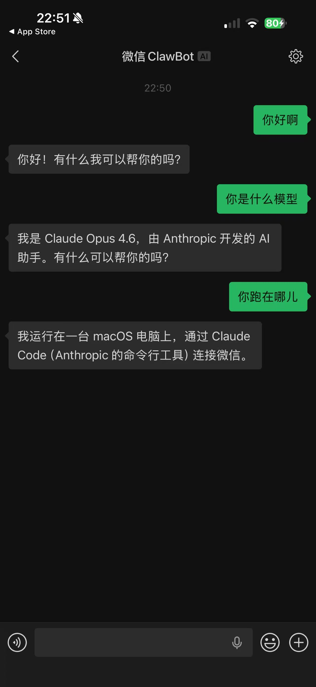

# WeChat Channel for Claude Code

[中文](./README.md)

Bridge your personal WeChat messages to [Claude Code](https://docs.anthropic.com/en/docs/claude-code) via the [MCP channel protocol](https://code.claude.com/docs/en/channels).

Send a message from your phone in WeChat, and Claude Code receives it, processes it, and replies — right back to your WeChat chat.

<p align="center">
  
</p>

## How It Works

```
┌──────────┐       ilink bot API       ┌─────────────┐      MCP stdio      ┌────────────┐
│  WeChat  │ ◄──────────────────────── │ channel.mjs │ ◄────────────────── │ Claude Code│
│   App    │ ──────────────────────►   │ (MCP server)│ ──────────────────► │            │
└──────────┘   long-poll / sendmsg     └─────────────┘   notifications     └────────────┘
   Phone          ilinkai.weixin.qq.com    Your machine       + reply tool       Terminal
```

1. You scan a QR code with WeChat to link your account
2. The channel long-polls WeChat's ilink bot API for new messages
3. Incoming messages are forwarded to Claude Code as MCP channel notifications
4. Claude Code replies via the `reply` tool, which sends the response back to your WeChat

This uses WeChat's official **ilink bot protocol** — the same protocol behind the official [`@tencent-weixin/openclaw-weixin`](https://www.npmjs.com/package/@tencent-weixin/openclaw-weixin) plugin by Tencent.

---

## Prerequisites

| Requirement | Why |
|---|---|
| **Node.js >= 22** | Required for native `fetch` support |
| **Claude Code >= v2.1.80** | Channel support (research preview) |
| **Claude Code login via claude.ai** | Channels require claude.ai auth, not API keys |
| **A WeChat account** | Personal WeChat (not WeCom/enterprise) |

---

## Installation

### Option A: Quick Setup (recommended)

```bash
git clone https://github.com/user/wechat-claude-code-channel.git
cd wechat-claude-code-channel
./setup.sh
```

The setup script will:
- Verify Node.js >= 22 is installed
- Run `npm install`
- Detect your `node` binary path
- Generate a `.mcp.json` config file with the correct absolute paths

### Option B: Manual Setup

```bash
git clone https://github.com/user/wechat-claude-code-channel.git
cd wechat-claude-code-channel
npm install
```

Create a `.mcp.json` file in the project directory:

```json
{
  "mcpServers": {
    "wechat": {
      "command": "node",
      "args": ["/absolute/path/to/wechat-claude-code-channel/channel.mjs"]
    }
  }
}
```

> **nvm users:** The `"command"` must be the full path to your Node.js binary, because Claude Code spawns the channel as a subprocess without loading your shell profile. Find it with `which node`, e.g. `"/Users/you/.nvm/versions/node/v22.22.1/bin/node"`.

---

## Using from Any Directory

By default, Claude Code only reads `.mcp.json` from the **current directory**. If you want to use the WeChat channel from other project directories, you have several options:

### Option 1: Register as a global MCP server (recommended)

Use `claude mcp add` to register the WeChat channel globally, so it's available from any directory:

```bash
claude mcp add wechat -- $(which node) $(pwd)/channel.mjs
```

Then start from any directory:

```bash
cd ~/my-project
claude --dangerously-load-development-channels server:wechat
```

To remove the global registration:

```bash
claude mcp remove wechat
```

### Option 2: Copy the config file to your target directory

Since `setup.sh` generates `.mcp.json` with absolute paths, you can copy it to any project directory:

```bash
cp ~/wechat-claude-code-channel/.mcp.json ~/my-project/.mcp.json
```

Then start from that directory:

```bash
cd ~/my-project
claude --dangerously-load-development-channels server:wechat
```

> **Tip:** If you don't want to commit `.mcp.json` to the other project's git repo, add `.mcp.json` to that project's `.gitignore`.

### Option 3: Always start from the project directory

The simplest approach — always launch Claude Code from this project's directory:

```bash
cd ~/wechat-claude-code-channel
claude --dangerously-load-development-channels server:wechat
```

Once Claude Code starts, you can ask it to work on files in other directories from within the conversation.

---

## Usage

### Step 1: Start Claude Code with the channel

```bash
# After global registration, start from any directory
claude --dangerously-load-development-channels server:wechat

# Or start from the project directory
cd /path/to/wechat-claude-code-channel
claude --dangerously-load-development-channels server:wechat
```

> The `--dangerously-load-development-channels` flag is required during the channel research preview. It tells Claude Code to load the custom channel defined in `.mcp.json`.

### Step 2: Login with WeChat

On first launch, the channel has no saved credentials. Claude Code will automatically call the `wechat_login` tool, which returns an **ASCII QR code** directly in the conversation:

```
▄▄▄▄▄▄▄▄▄▄▄▄▄▄▄▄▄▄▄▄▄▄▄▄▄▄▄▄▄▄▄▄▄▄▄▄▄▄▄
█ ▄▄▄▄▄ █▄▄██████▄▀▀▄██▄  ▀▄█▀█ ▄▄▄▄▄ █
█ █   █ █ ▀█ ▄ ▄▀ ▀██ ██▄▄▄ ▄██ █   █ █
█ █▄▄▄█ █▄ ▄▄▀ ▀▄▄▄▀  █▄█▀█ ▄██ █▄▄▄█ █
...
```

**Open your WeChat app → Discover → Scan** (or tap the `+` button → Scan) and scan the QR code from your terminal.

After scanning, confirm the login on your phone. You'll see a notification in Claude Code:

```
WeChat login successful! Bot connected.
```

Credentials are saved at `~/.claude/wechat-channel/credentials.json` and reused on subsequent starts — you only need to scan once.

### Step 3: Send messages from WeChat

Once connected, **send any text message in WeChat** to the bot. The message appears in your Claude Code session, and Claude can reply back to your WeChat chat.

Example flow:

1. You send "What's in my current git repo?" from WeChat
2. Claude Code receives the message via the channel
3. Claude runs `git log`, reads files, etc.
4. Claude calls the `reply` tool to send the answer back to your WeChat

### Step 4: Keep chatting

The channel stays connected as long as Claude Code is running. You can send multiple messages back and forth between WeChat and Claude Code.

---

## Tools

The channel exposes three tools to Claude Code:

### `reply`

Send a text message back to a WeChat user.

| Parameter | Type | Description |
|---|---|---|
| `to` | string | The WeChat user ID (from the `from` attribute of the incoming channel message) |
| `text` | string | The message to send |

Messages longer than 4000 characters are automatically split into multiple messages.

### `wechat_login`

Initiate a new QR code login. Returns immediately with an ASCII QR code. Background polling waits for the scan and sends notifications on status changes (scanned, confirmed, expired).

Use this to:
- Connect for the first time
- Reconnect after a session expires

### `wechat_allow`

Add a WeChat user ID to the allowlist.

| Parameter | Type | Description |
|---|---|---|
| `user_id` | string | The WeChat user ID to allow |

By default, the user who scans the login QR code is automatically added. Additional users must be explicitly allowed.

---

## Security & Allowlist

Only messages from **allowlisted users** are forwarded to Claude Code. This prevents other WeChat users from injecting messages into your coding session.

- The user who scans the QR code is **automatically allowlisted**
- Additional users can be added via the `wechat_allow` tool or by editing `~/.claude/wechat-channel/allowlist.json`
- If the allowlist is empty (file missing or `[]`), **all messages** are forwarded (not recommended)

---

## File Locations

All state is stored **outside the project directory** so nothing sensitive is accidentally committed:

```
~/.claude/wechat-channel/
├── credentials.json   # Bot token + bot ID (chmod 600)
├── sync-buf.txt       # Long-poll cursor for message sync
└── allowlist.json     # Allowed sender user IDs
```

The project directory only contains source code and `node_modules`. The generated `.mcp.json` (with your local paths) is in `.gitignore`.

---

## Architecture

This channel is a single-file [MCP](https://modelcontextprotocol.io/) server (`channel.mjs`) that:

1. **Declares** `claude/channel` capability so Claude Code treats it as a channel
2. **Connects** via stdio transport (Claude Code spawns it as a subprocess)
3. **Authenticates** with WeChat via QR code login (ilink bot protocol)
4. **Long-polls** `ilinkai.weixin.qq.com/ilink/bot/getupdates` for new messages
5. **Pushes** messages to Claude Code as `notifications/claude/channel` events
6. **Exposes** a `reply` tool so Claude Code can send messages back

### Protocol Details

| Operation | Endpoint | Method |
|---|---|---|
| Get QR code | `ilink/bot/get_bot_qrcode?bot_type=3` | GET |
| Poll QR status | `ilink/bot/get_qrcode_status?qrcode=...` | GET (long-poll) |
| Get messages | `ilink/bot/getupdates` | POST (long-poll) |
| Send message | `ilink/bot/sendmessage` | POST |

All API requests use `Authorization: Bearer <token>` obtained during QR login.

### Dependencies

| Package | Purpose |
|---|---|
| `@modelcontextprotocol/sdk` | MCP server framework (stdio transport, tool handlers) |
| `qrcode-terminal` | Renders QR codes as ASCII art for terminal display |

---

## Troubleshooting

### QR code doesn't display properly

The QR code is rendered as ASCII block characters. If your terminal font doesn't support them, the fallback URL is also provided. You can:
- Open the URL on your phone's browser — it shows "请使用微信扫码打开" (scan with WeChat to open). Use WeChat's Scan feature on your phone to scan **your phone's own screen** (screenshot, then scan from album).
- Or use a different terminal with better Unicode support.

### "Session expired" notification

WeChat sessions expire after some time. When this happens, the channel sends a notification and stops polling. Claude Code will need to call `wechat_login` again, or you can restart the session:

```bash
# Delete saved credentials and restart
rm ~/.claude/wechat-channel/credentials.json
claude --dangerously-load-development-channels server:wechat
```

### Messages not arriving in Claude Code

1. **Check the allowlist:** Is the sender in `~/.claude/wechat-channel/allowlist.json`?
2. **Check credentials:** Does `~/.claude/wechat-channel/credentials.json` exist?
3. **Check the process:** Is the channel subprocess running? (`ps aux | grep channel.mjs`)
4. **Check logs:** Channel logs go to stderr with the `[wechat-channel]` prefix.

### "Not logged in" when trying to reply

Run the `wechat_login` tool from within Claude Code, or restart Claude Code with the channel flag.

### Node.js version errors

This project requires Node.js 22+ for native `fetch` support. If you see fetch-related errors:

```bash
node --version  # Must be v22.x or higher
```

### nvm: "node not found" when Claude Code starts the channel

Claude Code spawns the channel as a subprocess **without loading your shell profile**, so nvm's node isn't on PATH. Use the full path to node in `.mcp.json`:

```json
{
  "mcpServers": {
    "wechat": {
      "command": "/Users/you/.nvm/versions/node/v22.22.1/bin/node",
      "args": ["/path/to/wechat-claude-code-channel/channel.mjs"]
    }
  }
}
```

Run `./setup.sh` to auto-detect and configure this.

---

## FAQ

**Q: Does this use an unofficial/reverse-engineered WeChat protocol?**
A: No. This uses WeChat's official **ilink bot protocol** at `ilinkai.weixin.qq.com` — the same protocol used by Tencent's own [`@tencent-weixin/openclaw-weixin`](https://www.npmjs.com/package/@tencent-weixin/openclaw-weixin) plugin.

**Q: Do I need OpenClaw?**
A: No. This is a standalone channel that connects directly to Claude Code via MCP. No OpenClaw installation required.

**Q: Can multiple people send messages to Claude Code?**
A: Yes, but each sender must be in the allowlist. The user who scans the QR code is added automatically. Use the `wechat_allow` tool to add others.

**Q: What message types are supported?**
A: Currently **text messages** and **voice messages** (transcribed text). Images, files, and videos are detected but not forwarded as media — the channel notes `[non-text message]` for these.

**Q: How long does the login session last?**
A: Sessions are managed by WeChat's server and may expire after hours or days. When expired, the channel notifies Claude Code and you need to scan a new QR code.

**Q: Is my WeChat data sent to Anthropic?**
A: Messages you send from WeChat are forwarded to Claude Code, which processes them through the Anthropic API just like any other Claude Code input. The channel itself does not send data anywhere other than `ilinkai.weixin.qq.com` (for WeChat communication) and Claude Code (via local stdio).

**Q: Can I use this with WeCom (enterprise WeChat)?**
A: No, this uses the personal WeChat ilink bot protocol. For WeCom, see the [`@wecom/aibot-node-sdk`](https://www.npmjs.com/package/@wecom/aibot-node-sdk).

---

## License

MIT
